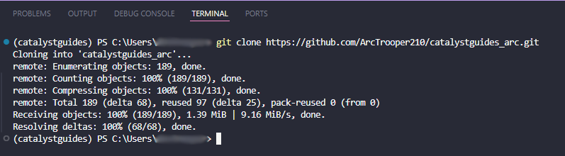

# Contributing to Catalyst Guides
[](https://www.mkdocs.org)


## Contributing Guidelines

???+ warning "Guidelines"
    1. Do **NOT** touch `mkdocs.yml`, `pyproject.toml`, or workflow files unless given **explicit permission** AND you know what you're doing.
    2. Do **NOT** republish **Catalyst Guides** live on another site.
    3. You should not get any warning or errors when running `uv run mkdocs serve | build`.
        a. Resolve/get help for any warnings/errors before pushing.
        b. Never disable strict mode for **any** reason unless you have consulted with the team.
    4. Do **NOT** delete or drastically change another author's work (unless they're typos or factual errors) without permission from the *original* author.
    5. No inappropriate content (Profanity, NSFW, Paid content)
        a. Violaters will be banned from the repository.
    6. All guides should follow the [Writing Your Guide](#writing-your-guide) format.
    7. File and folder names must be **lowercase** with no spaces. Image files can use [camelCase](https://en.wikipedia.org/wiki/Camel_case).
    8. Eliminate/minimize external links to content like document, images, or videos.
        a. This helps to keep everything together for offline use.

---

## Requirements

- [Python 3.1+](https://www.python.org/downloads/)
- [Github Desktop](https://desktop.github.com/download/), [Git CLI](https://cli.github.com), or [Visual Studio Code](https://code.visualstudio.com/download)
- [UV Package Manager](https://docs.astral.sh/uv/getting-started/installation/#winget)

---

## Getting Started

You will be required to [Serve (Live preview)](#serve-live-preview) and [Build](#build) this site.

### Fork and Enable Workflows

Fork the [Catalyst Guides](https://github.com/Catalyst-Studios/catalystguides/fork) repository, then enable **GitHub Workflows**.

{.center}
{.center}

---

### Clone `main` Branch

Now you'll want to **Clone** your forked repository using your preferred program.

??? ghdesk "GitHub Desktop"
    Go to `File` :material-arrow-right-thin: `Clone repository...` OR do `Ctrl+Shift+O` and select your Catalyst Guides fork. (I put `_arc` for my own sorting purposes)

    {.center width='400px'}
    {.center width='400px'}

    !!! info "I recommend putting the repository under `C:/Users/yourPCName` for easy access"

    !!! question "Need help? Check out [GitHub Desktop's official docs!](https://docs.github.com/en/desktop/adding-and-cloning-repositories/cloning-and-forking-repositories-from-github-desktop#cloning-a-repository)"

??? vsc "Visual Studio Code"
    1. Go to your Catalyst Guides fork and click `<> Code` and copy the **HTML link**.
    {.center width='400px'}
    {.center width='400px'}
    2. In VsCode do ++ctrl+grave-accent++ to open the Terminal
    3. Type `git clone` then press space, then paste the link.
    

    !!! question "Need help? Check out this [Geeks for Geeks article!](https://www.geeksforgeeks.org/how-to-clone-a-project-from-github-using-vscode/)"

---

### Installing UV and Plugin Dependencies

```yaml title='Install UV'
winget install --id=astral-sh.uv  -e
```

Catalyst Guides has a few Python dependencies that provide additional features for making guides.

```yaml title='Install Dependencies'
uv sync
```

---

## Serve (Live Preview)

While you're making your guide, you can preview it by hosting the Catalyst Guides site locally at `127.0.0.1:8000` or `localhost:8000`. This will also let you know about any warnings or errors that occur during the [build](#build) process.

```
uv run mkdocs serve
```

---

## Writing Your Guide

All guides **must** be Markdown files (`.md`).

To make a guide, make a new `.md` file within the `docs/` folder. Once created, you can view the new page using [Serve](#serve-live-preview).

Check out [the formatting guide](examples/README.md) for every formatting option available to you in **Catalyst Guides**!

---

### Guide Format

???+ danger "Warning"
    **DON'T** use ++tab++ to indent a list of authors in the `authors` section of document headers. It *WILL* cause syntax errors. 

    Use a single space instead.

!!! warning "The highlighted lines are required!"

```yaml title='exampleGuide.md' hl_lines="1 2 3 4 8 10 18"
---
title: documentName
description: some description
authors:
 - John
 - Jane
 - Bob
---

# Guide Title

Content.

## Second Header

More content.

> modName | [Curseforge](legacy.curseforge link) 
```

### Making Navigation files (Optional)
  
If you want to list the pages of your guide in its own order, you can create a `.pages` file to list an order rather than the default alphabetical order. You can also give pages different names.

???+ danger "Warning"
    **DON'T** use ++tab++ to indent a list of pages in `.pages` files. It *WILL* cause syntax errors. 

    Use a single space instead.

!!! warning "The highlighted lines are required!"

```yaml title='.pages File Example' hl_lines="1 20"
nav:
 - index.md
 - about.md

# You can give names to pages
 - Home: index.md
 - About: about.md

# Navigation sub-sections can be created
 - Home: index.md
 - User Guide:
   - Writing your docs: writing-your-docs.md
   - Styling your docs: styling-your-docs.md
 - About:
   - License: license.md
   - Release Notes: release-notes.md

# You MUST put 3 dots at the end of each .pages file
# This will list any pages that aren't defined above
 - ...
```

---

## Build

Before making a [Commit](#making-a-commit), you should build the site which will compile Markdown into HTML. 

This should succeed **without** any warnings or errors before making a [commit](#making-a-commit).

```
uv run mkdocs build
```

---

## Making a Commit

Commiting sends your changes to your fork of Catalyst Guides on GitHub. From there you can then submit a [Pull Request](#making-a-pull-request-pr).

### Commit with GitHub Desktop

All changes made will be selected by default, if you do not want to commit some changes, deselect those.
	
1. Fill out the `Summary` and `Description` on the bottom left, click `Commit to main` when you're ready to commit.
2. If you made a mistake, you can undo the commit in the bottom left. Otherwise click `Push origin` to push the commit to GitHub.


---

## Making a Pull Request (PR)

When you submit a PR, you're requesting us to **Pull** changes from your repository to ours and then deployed on the [live Catalyst Guides site](https://catalyst-studios.github.io/catalystguides/).

After making your [Commit](#making-a-commit), go to your [fork of Catalyst Guides](https://github.com/Catalyst-Studios/catalystguides/forks) on GitHub and you'll see a yellow banner with a button that says `Compare & pull request`.

Click it, then add a `Title` and what you've changed in the `Description`, then click `Create pull request`.


---

## More Resources

Most of everything that you need to know is explained on this page or in the [Formatting Examples](examples/README.md) section.

If you have any question, feel free to [join the Discord](https://discord.gg/YCHPXeW9GZ)!

- [Markdown Basics](https://github.com/adam-p/markdown-here/wiki/Markdown-Cheatsheet)
- [Mkdocs Writing Your Docs](https://www.mkdocs.org/user-guide/writing-your-docs/)
- [Material Reference Docs](https://squidfunk.github.io/mkdocs-material/reference/)
- [Material PyMdown Extensions](https://squidfunk.github.io/mkdocs-material/setup/extensions/python-markdown-extensions/)
- [PyMdown Extensions Docs](https://facelessuser.github.io/pymdown-extensions/extensions/arithmatex/)

### FAQ

??? question "My header is displaying above the page title."
    - You likely put a ++tab++ indent in your list of authors.
    - Remember, only use a single space when indenting
    
    ``

??? question "My authors are being spelled out letter by letter."
    - You didn't put a space after the hyphen and before the author name.
    - It is `- authorName`, not `-authorName`
    
    ``
    
??? question "My locally hosted preview won't refresh with changes."
    - Check your PowerShell console output and see if it produces any `warning` or `error`. It will tell you exactly what is wrong.
    - Most likely, you have a misspelled file name or you have the incorrect path to an image.
    
    ``

> Catalyst Guides | [GitHub](https://github.com/Catalyst-Studios/catalystguides) | [Discord](https://discord.gg/YCHPXeW9GZ)
