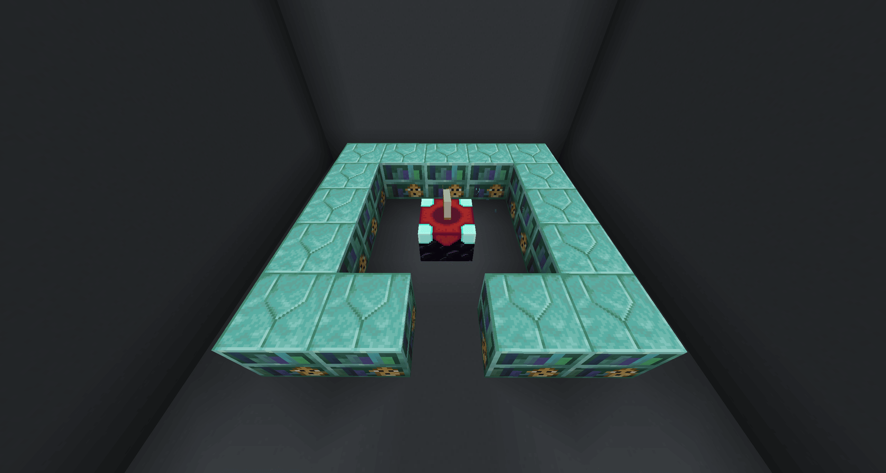
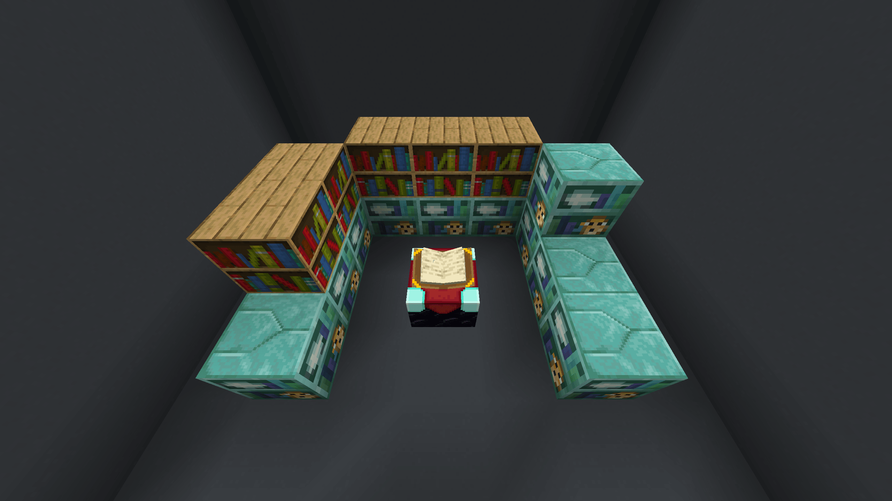
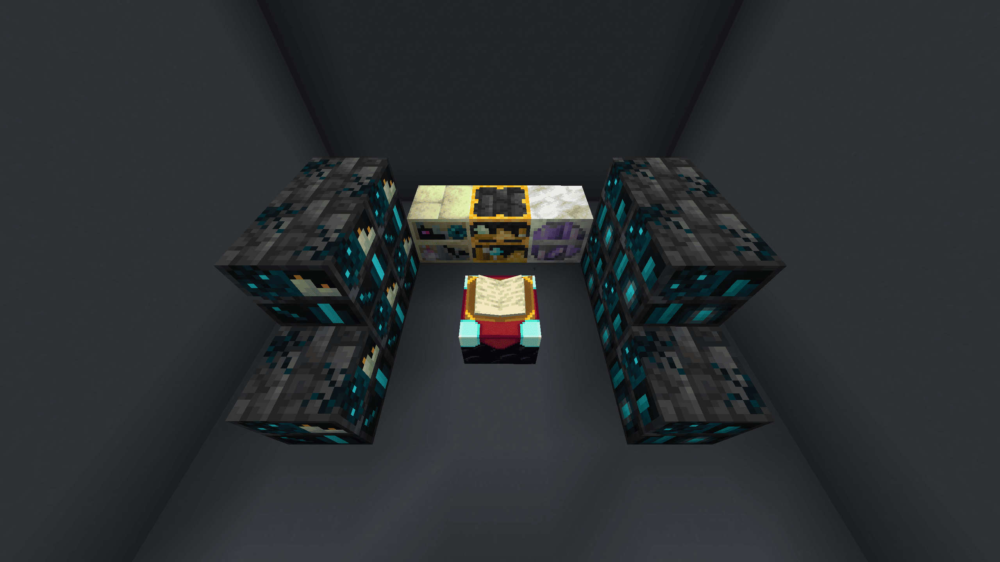
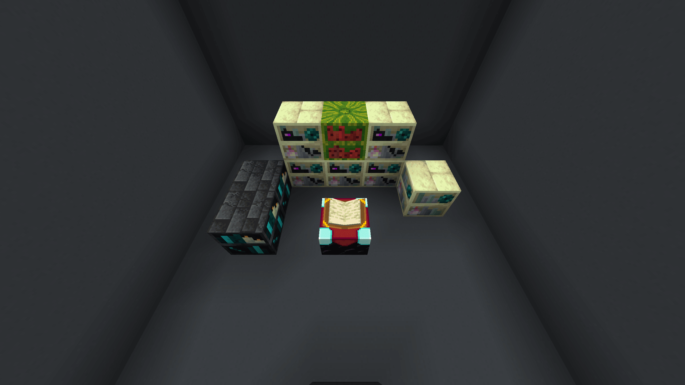
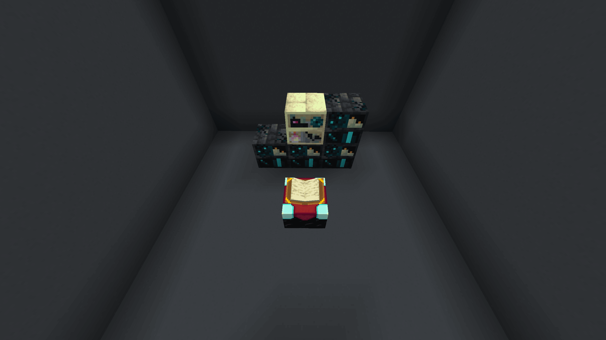
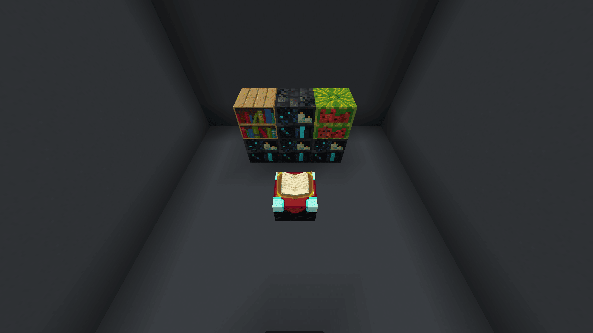

# Apothic Enchanting

!!! info "If you find any typos/errors, ping @ArcTrooper on the [Discord!](https://discord.gg/YCHPXeW9GZ)"

## Max Enchanting Setup

??? information "Max Enchanting Shelves List"
	- [ ] 5x **Echoing Sculkshelf**
	- [ ] 5x **Soul-Touched Sculkshelf**
	- [ ] 1x **Deepshelf of Arcane Treasures**
	- [ ] 1x **Draconic Endshelf**
	- [ ] 1x **Geode-Encased Bookcase of Stability**

Craft 16x **Seashelf** and place all but one in the usual enchanting configuration.  

{.center}

Now take your last Seashelf and **infuse it**. You should see an infusion option for 3 EXP. Now replace one of the uninfused **Seashelf** with your **Infused Seashelf**. Repeat this until all 16 `Seashelf` are `Infused Seashelf`. You will have one extra `Infused Seashelf`.

!!! info "You must be level 45+ to infuse Seashelves"

---

After all of shelves are infused, you'll need to break 13x Infused Seashelf and craft 13x **Crystalline Seashelf**. After you're done crafting them, place them down.

Now craft 10x **Dormant Deepshelf** and infuse them into their **Deepshelf** varient.

!!! info "You must be level 60+ to infuse Dormant Deepshelves"

After infusing all 10 dormant deepshelves, use them to craft 5x **Soul-Touched Sculkshelf** and 5x **Echoing Sculkshelf**.

!!! tip "Remember to use JEI to see the recipes. You'll need to kill a few Wardens"

---

Now you'll need to craft 1x **Geode-Encased Bookcase of Stability**.

You can infuse a **Block of Amethyst** to get **Budding Amethyst**. Place 10x **Crystalline Seashelf** and 5x **Normal Bookshelves** to infuse it.

!!! info "You must be level 65+ to infuse Block of Amethyst"

{.center}

---

To craft 1x **Draconic Endshelf** we need **Infused Dragon's Breath**.

!!! abstract ""
	- 5x **Echoing Sculkshelf** 
	- 2x **Soul-Touched Sculkshelf**
	- 5x **Melonshelf**
	- 5x **Normal Bookshelf**
	- 1x **Geode-Encased Bookcase of Stability**

!!! info "You must be level 80+ to infuse Dragon's Breath"

{.center}

---

After making the **Draconic Endshelf**, craft 1x **Deepshelf of Arcane Treasures** and then place your crafted shelves for max enchants!

!!! example ""
	- 5x **Echoing Sculkshelf**
	- 5x **Soul-Touched Sculkshelf**
	- 1x **Deepshelf of Arcane Treasures**
	- 1x **Draconic Endshelf**
	- 1x **Geode-Encased Bookcase of Stability**

!!! tip "You can place a **Seashelf of Aquatic Filtration** to filter out enchants you don't want."

{.center}

---

## Infusion Setups

You do not have to place the blocks exactly as I do, these are just an example.

### Unbreakable Potion Charms

!!! info "5x Draconic Endshelf, 2x Echoing Deepshelf, 1x Melonshelf, 1x Endshelf"

{.center}

### Tome of Superior Scrapping

!!! info "3x Echoing Sculkshelf, 1x Draconic Endshelf"

{.center}

### Tome of Extraction

!!! info "4x Echoing Sculkshelf, 1x Draconic Endshelf"

{.center}

### Library of Alexandria

!!! info "6x Echoing Sculkshelf, 3x Melonshelf, 2x Draconic Endshelf, 2 Infused Seashelf"

{.center}

### Trident

!!! info "4x Echoing Sculkshelf, 1x Melonshelf, 1x Normal Bookshelf"

{.center}

### Bottle o' Enchanting

=== "1 Bottle"
	!!! info "2x Echoing Sculkshelf"

	{.center}

=== "8 Bottles"
	!!! info "5x Echoing Sculkshelf, 1x Soul-Touched Sculkshelf"

	{.center}

=== "32 Bottles"
	!!! info "5x Echoing Sculkshelf, 3x Soul-Touched Sculkshelf, 1x Draconic Endshelf"

	{.center}

> Apothic Enchanting | [CurseForge](https://legacy.curseforge.com/minecraft/mc-mods/apothic-enchanting)
